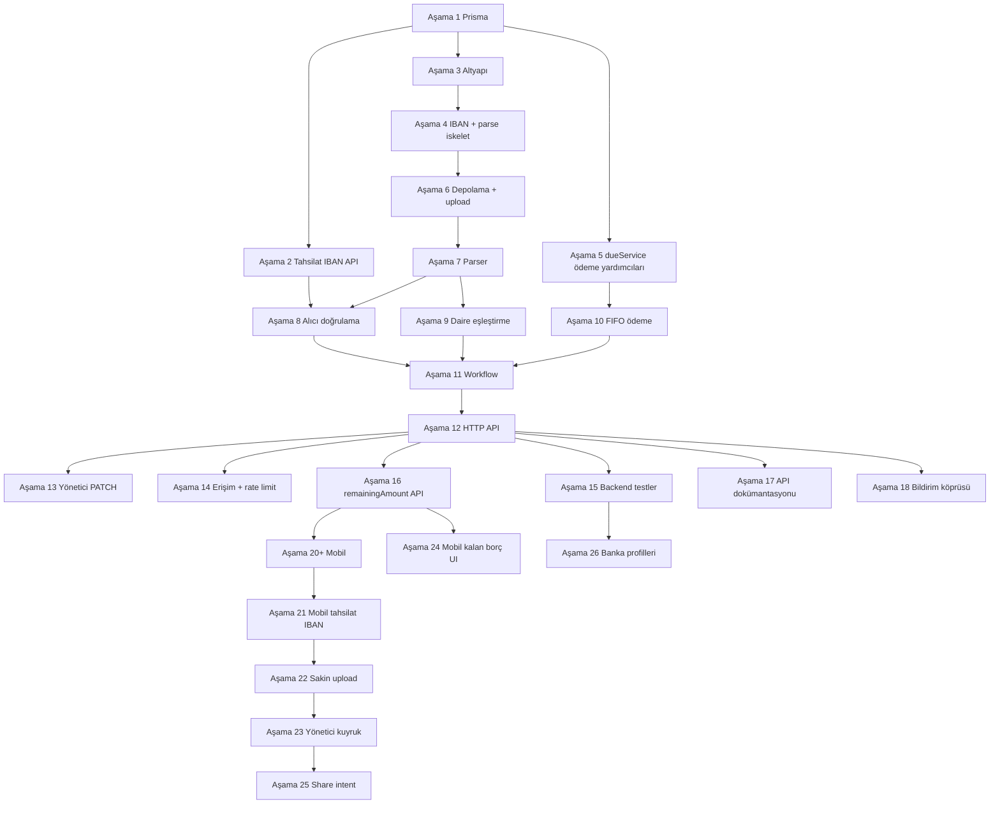

# Dekont sistemi — uygulama rehberi ve plan

> **Amaç:** AidatPanel backend’ine dekont (PDF/görüntü) yükleme, metin çıkarma, banka şablonlarına göre parse, Due ile eşleştirme ve ödeme/borç güncellemesi eklenmesi.  
> **Kapsam notu:** Bu belge **tasarım + yol haritası + repo analizidir**; uygulama sırasında mevcut **klasör adları, dosya isimlendirme ve Express/Prisma kalıpları** korunur (`backend/src/middlewares/`, `backend/src/services/`, `backend/index.js` vb.).

> **Son analiz:** 2026-05-15 — `backend/yedek` dalı (backend), `mobile/app` dalı (Flutter). Dekont kodu **henüz yok**; §1–§15 hedef mimari, §17–§19 mevcut kod tabanı analizi ve plan uyumu.

### Durum özeti (tek bakışta)

| Alan | Dal | Dekont | Not |
|------|-----|--------|-----|
| Backend API + Prisma | `backend/yedek` | ⏳ Aşama 1 şema | Dekont Prisma + migration; API henüz yok |
| Flutter mobil | `mobile/app` | ❌ Yok | Faz 1 aidat UI var; share intent / multipart upload yok |
| Bu belge §16 (eski) | — | ⚠️ Güncellendi | “Uygulandı” iddiası kaldırıldı; aşağıda §17–§19 |

---


## 1. Mevcut ana proje ile hizalama

Aşağıdaki yapı **değiştirilmeden** kullanılır; yeni kod aynı kalıplara eklenir.

| Konu | Ana projedeki karşılık |
|------|-------------------------|
| Giriş noktası | `backend/index.js` — `app.use("/api/v1/...", router)` |
| Rotalar | `backend/src/routes/*.js` |
| Controller’lar | `backend/src/controllers/*.js` |
| Servisler | `backend/src/services/*.js` |
| Middleware | `backend/src/middlewares/*.js` (çoğul; `middleware` değil) |
| Doğrulama | `backend/src/middlewares/validate.js` + mevcut `zod` şemaları |
| Auth / rol | `authMiddleware.js`, `roleMiddleware.js` |
| ORM | `backend/prisma/schema.prisma` + `prisma migrate` |
| Aidat iş mantığı | `backend/src/services/dueService.js` — dekont sonrası güncellemeler mümkün olduğunca burada veya onu çağıran ince bir serviste toplanır (tekrarlı Due mantığı yazılmaz). |

---

## 2. Özellik özeti (iş ihtiyacı)

- Flutter’dan gelen **PDF** veya **görüntü** sunucuda işlenir.
- Metin çıkarımı: **PDF** için `pdf-parse` (veya eşdeğeri; güvenlik güncellemelerine göre proje kararı), **görüntü** için `tesseract.js` (veya barındırma koşullarına göre dış OCR servisi — uzun vadede VPS yükü için değerlendirme maddesi).
- Türk bankaları dekontlarından hedef alanlar: gönderen adı, alıcı adı, alıcı IBAN, alıcı hesap numarası, tutar, tarih, banka adı, sorgu/referans no.
- Parse sonucu ve ham metin **veritabanında** saklanır; dosya **diskte** tutulur.
- **Daire bağlamı** (sakin hesabı, referans kodu, isteğe `targetMonth`/`targetYear`) ile hangi dairenin ödediği bulunur; **tek bir Due’ya kilitleme zorunlu değildir**.
- **Ödeme tahsisi (FIFO):** Aynı dairede birden fazla ödenmemiş aidat varsa dekont tutarı **en eski dönemden başlayarak** sırayla düşülür (§6.4).
- **Alıcı doğrulama:** Havale **gerçekten sitenin/yöneticinin bildirdiği tahsilat hesabına** mı gitti? Karar **IBAN / hesap no** ve isteğe **referans kodu** ile verilir; yalnızca alıcı adı ↔ yönetici adı kıyası **otomatik onay için yeterli değildir** (§6.5).
- **Ödeme kaydı:** `DuePayment` satırları; tam ödenen `Due` → `PAID` + `paidAt` (dekont işlem tarihi). Kısmi ve çoklu Due tahsisi §6.3–§6.4.

---

## 3. Banka / şablon değişikliklerine hızlı adaptasyon (sürdürülebilirlik)

Tek dev bir “regex dosyası” yerine **katmanlı ve genişletilebilir** yapı önerilir; bakım ve code review kolaylaşır.

### 3.1 Klasör stratejisi (öneri)

Tüm banka/şablon mantığı **tek bir kök altında** toplanır; derin hiyerarşi yok (2–3 seviye):

```
backend/src/config/dekont/
  index.js                 # Dışarı açılan tek giriş: registry + varsayılan sıra
  normalizeText.js         # OCR/PDF gürültüsü: boşluk, TR harf, tutar normalizasyonu (bankadan bağımsız)
  registry.js              # Hangi profil sırasıyla denenecek (priority listesi)
  profiles/
    _base.js               # Ortak yardımcılar (tutar/IBAN/tarih parse yardımcıları)
    generic-placeholder.js # MVP / bilinmeyen banka
    ziraat-v1.js           # Örnek: bir banka = bir dosya (veya aile başına bir dosya)
    garanti-v1.js
    ...
```

- **Yeni banka / yeni şablon:** `profiles/` altına yeni dosya + `registry.js` içinde sıraya ekleme. Mümkünse dosya adı: `{bankaKisaAd}-v{n}.js` (şablon değişince `v2` ile yan yana yaşatılabilir).
- **A/B ve geri alma:** Eski profil dosyası silinmeden durur; registry’de öncelik değiştirilir.
- **Denetim:** Her başarılı/başarısız parse için DB’de `patternProfileId` veya `parserVersion` alanı tutulur (hangi kural seti kullanıldı).

### 3.2 Regex yerine / regex ile birlikte

- Kısa vadede **regex + satır bazlı kurallar** yeterli olabilir.
- Orta vadede aynı profil içinde **“satır etiketi → alan”** eşlemesi (ör. `referans:` sonrası token) regex’leri küçük tutar.
- İleride JSON tabanlı “kural seti” (repo dışı deploy ile güncellenebilir) isteğe bağlı genişleme olarak not edilir; **ilk uygulamada** kod içi `profiles/` yeterli ve tip güvenliği korunur.

---

## 4. Dosya depolama — basit ve bakımı kolay yapı

**Kök:** `backend/files/dekonts/` (veya `.env` ile `DEKONT_STORAGE_ROOT` — tek değişkenle taşınabilirlik).

**Önerilen göreli yol şablonu** (çok derin olmayan, ID ile listelemesi kolay):

```text
files/dekonts/{buildingId}/{YYYY}/{MM}/{dekontId}_{slug-orijinal-ad}.{ext}
```

- **buildingId:** Liste/filtre ve yedekleme için doğal bölüm.
- **YYYY/MM:** klasör başına dosya sayısı kontrolü; tam günlük klasör (`.../2026/05/14/`) derinliği artırır — istenirse sadece `YYYY-MM` yeterli.
- **Dosya adı:** Depoda **orijinal ad güvenilir değil**; UUID (`dekontId`) önek zorunlu, orijinal ad URL-safe kısaltılmış eklenebilir.
- **`.gitignore`:** `files/dekonts/` veya tüm `files/` repo dışı kalır; üretimde yedek stratejisi ayrı tanımlanır.

**İndirme:** `GET /api/v1/dekont/:id/download` (veya file URL) — sadece yetkili kullanıcı; mümkünse kısa ömürlü imzalı link (ileri faz).

---

## 5. Güvenlik (uzun vade)

- **Boyut limiti** ve **MIME + magic byte** kontrolü (sadece uzantıya güvenilmez).
- **Rate limit:** Upload için genel API limitinden sıkı veya ayrı limit (mevcut `rateLimitMiddleware.js` ile uyumlu).
- **KVKK:** Dekont PII içerir; erişim yalnızca ilgili sakin / bina yöneticisi; silme politikası `User.deletedAt` ile uyumlu düşünülür.
- **İsteğe bağlı:** ClamAV veya benzeri (VPS kapasitesine göre roadmap).

---

## 6. Prisma — eksiklerin tamamlanması (uygulama anında)

Aşağıdaki modeller **bu belgeye göre** `schema.prisma` ve migration ile eklenecek; mevcut modellere dokunmadan ilişki kurulabilir.

### 6.1 Enum’lar

```prisma
enum DekontStatus {
  RECEIVED           // dosya alındı
  EXTRACTING         // metin çıkarılıyor
  EXTRACT_FAILED
  PARSED             // yapısal alanlar doldu
  PARSE_LOW_CONFIDENCE
  MATCHING
  MATCHED
  MATCH_AMBIGUOUS    // birden fazla aday Due
  UNMATCHED
  PAYMENT_APPLIED
  PAYMENT_PARTIAL      // kısmi ödeme kaydı oluşturuldu
  REJECTED             // politika / doğrulama reddi
  RECIPIENT_MISMATCH   // parse edilen alıcı IBAN/hesap, binanın kayıtlı tahsilat hesabıyla uyuşmuyor
  NEEDS_MANAGER_REVIEW
}

enum DekontSource {
  RESIDENT_UPLOAD
  MANAGER_UPLOAD
}
```

`NotificationType` genişletmesi (push + uygulama içi bildirim uyumu):

```prisma
// Mevcut enum'a eklenecek değer örneği:
// DEKONT_RECEIVED
// DEKONT_MATCHED
// DEKONT_PAYMENT_APPLIED
// DEKONT_NEEDS_REVIEW
```

(Flutter / `FLUTTER-BACKEND.md` ile payload sözleşmesi aynı sprintte netleştirilir.)

### 6.2 `Dekont` modeli (öneri alanlar)

- `id` (uuid), `buildingId` (veya eşleşmeden önce null — tercihe göre; pratikte upload sırasında kullanıcı bağlamından `buildingId` zorunlu kılınabilir)
- `apartmentId` (opsiyonel — biliniyorsa)
- `uploadedById` → `User`
- `dueId` (opsiyonel — eşleşince)
- `status` → `DekontStatus`
- `source` → `DekontSource`
- `storedPath` (göreli yol), `originalFilename`, `mimeType`, `sizeBytes`
- `rawText` (text, uzun olabilir — gerekirse ayrı tablo veya object storage + özet)
- `parsedJson` (`Json`) — çıkarılan alanlar + güven skorları
- `patternProfileId` veya `parserProfile` (`String`) — hangi profil kullanıldı
- `parseError` (`String?`)
- `recipientVerified` (`Boolean?`) — otomatik tahsilat hesabı doğrulaması geçti mi
- `verificationJson` (`Json?`) — IBAN eşleşme, referans, zayıf sinyaller, karar gerekçesi (denetim)
- `createdAt`, `updatedAt`

İndeks önerileri: `[buildingId, createdAt]`, `[uploadedById]`, `[status]`.

### 6.3 Kısmi ödeme — sürdürülebilir kayıt (`DuePayment` veya eşdeğeri)

Tek `Due` satırında tutarı “sessizce azaltmak” raporlama ve denetimi zorlaştırır. Öneri:

```prisma
model DuePayment {
  id        String   @id @default(uuid())
  dueId     String
  due       Due      @relation(fields: [dueId], references: [id], onDelete: Cascade)
  dekontId  String?
  dekont    Dekont?  @relation(fields: [dekontId], references: [id])
  amount    Decimal  @db.Decimal(12, 2)
  paidAt    DateTime // dekonttaki işlem tarihi
  currency  String   @default("TRY")
  note      String?
  createdAt DateTime @default(now())

  @@index([dueId])
  @@index([dekontId])
}
```

- **Tam ödeme:** `DuePayment` toplamı = Due tutarı → `Due.status = PAID`, `Due.paidAt` set.
- **Kısmi:** `DuePayment` eklenir; `Due.amount` **sabit kalabilir** (borç = amount − sum(payments)) veya iş kuralı olarak `amount` sadece “dönem borcu” olarak kalıp ödemeler ayrı toplanır — **tek kaynak:** raporlama `amount` ve `DuePayment` toplamından türetilir.
- `Due` modeline `dekonts Dekont[]` ve `payments DuePayment[]` ilişkileri eklenir (`Dekont` tarafında `dueId` + isteğe `payments`).

> Uygulama ekibi: Mevcut mobil ve yönetici ekranları “kalan borç” nasıl gösterecek netleştirilir; API yanıtlarında `remainingAmount` hesaplanabilir.

### 6.4 Ödeme tahsisi — en eski aidat önce (FIFO)

**Kural:** Bir dekont tutarı, belirli bir `apartmentId` için uygulanırken **yalnızca tek bir Due’ya** yazılmaz (istisna: yönetici `PATCH assign_due` ile tek kayda zorlar). Varsayılan: **açık borçlar kronolojik sırada kapatılır**.

**Açık borç kümesi:**

- `Due.status` ∈ `{ PENDING, OVERDUE }` ( `PAID`, `WAIVED` atlanır ).
- Sıra: `year ASC`, `month ASC`, `dueDate ASC` (aynı ayda tek kayıt varsayımı; çift kayıt varsa `createdAt ASC` tie-break).
- Her Due için **kalan borç:** `remainingDue = due.amount − SUM(due.payments.amount)` (Decimal, 2 hane).

**Tahsis algoritması** (`dekontPaymentService.applyFifoToApartment`):

```text
remaining ← dekont tutarı (parsedJson.fields.amount)
allocations ← []

FOR each due IN openDuesOrdered:
  IF remaining ≤ 0: BREAK
  slice ← MIN(remaining, remainingDue(due))
  IF slice > 0:
    INSERT DuePayment { dueId, dekontId, amount: slice, paidAt }
    IF remainingDue(due) - slice ≤ 0.02 TRY:  // tolerans §6.4.1
      SET due.status = PAID, due.paidAt = paidAt
    allocations.push({ dueId, amount: slice })
    remaining ← remaining - slice

dekont.status ←
  remaining = 0 AND tüm slice’lar ilgili Due’yu kapattıysa → PAYMENT_APPLIED
  remaining > 0 OR en az bir Due kısmen ödendiyse → PAYMENT_PARTIAL
  hiç DuePayment oluşmadıysa → UNMATCHED (veya önceki eşleştirme hatası)
```

**`Dekont.dueId`:** İlk tahsis edilen veya en eski kapatılan Due (raporlama/FCM için); **tam liste** `DuePayment` + upload yanıtında `allocations[]` döndürülür.

#### 6.4.1 Tutar toleransı

Yuvarlama / OCR: ±**0,02 TRY** içinde “tam kapandı” sayılır; aksi halde `PENDING` kalır ve kalan `remainingDue` raporlanır.

#### 6.4.2 `targetMonth` / `targetYear` (upload query)

- **Daraltma:** Matcher önce ilgili dönemi aday olarak işaretler; **FIFO yine tüm açık borçlara uygulanır** — sakin fazla ödeme yaptıysa fazlalık bir sonraki eski aya akar.
- Yalnızca o ayın borcunu kapatmak isteniyorsa tutar tam o `remainingDue` ile sınırlı olmalı; fazlası bilerek eski borca gider (iş kuralı metni mobilde gösterilir).

#### 6.4.3 Yönetici manuel müdahale

- `PATCH assign_due` + `applyPayment: true`: **tek Due**’ya zorlanmış tahsis (FIFO devre dışı).
- İleride isteğe `action: "apply_fifo"` — aynı dekontu yeniden dağıtma (idempotent: aynı `dekontId` için çift `DuePayment` engellenmeli).

### 6.5 Alıcı doğrulama — paranın doğru hesaba gitmesi

**Hedef:** Dekonttaki **alıcı (lehtar)** bilgisinin, aidatların toplandığı **resmî tahsilat hesabı** ile uyumlu olduğunu makul güvenle tespit etmek. Bu, “sakin doğru daire için mi ödedi?” sorusundan **ayrı** bir kontroldür; ikisi de sağlanmadan **tam otomatik** `PAYMENT_APPLIED` önerilmez.

#### 6.5.1 Kullanıcı önerisi: “Kayıtta yöneticiden hesap no iste” — eleştiri

| Artı | Eksi |
|------|------|
| Basit UX | Aidat çoğu sitede **binanın ortak hesabına** gider; yönetici şahsi IBAN’ı ile site hesabı farklı olabilir |
| | Bir yönetici **birden fazla bina** yönetir; tek kayıt yeterli değil |
| | IBAN değişince kayıt güncellemesi gerekir; kayıt anı = yanlış yaşam döngüsü |
| | “Hesap numarası” tek başına TR’de IBAN kadar güvenilir değil (şube + hesap ayrışması) |

**Sonuç:** Hesap bilgisi **`User` kaydında değil**, **`Building` (bina) bazında** tutulmalı. Yönetici kayıt/formunda değil; **bina oluşturma / bina ayarları / aidat ayarları** ekranında zorunlu veya dekont açılmadan önce tamamlanmış olmalı.

#### 6.5.2 Önerilen şema (`Building` genişlemesi)

```prisma
model Building {
  // ... mevcut alanlar ...
  /// Normalize edilmiş TR IBAN (boşluksuz, büyük harf). Tahsilatın birincil doğrulama anahtarı.
  collectionIban          String?
  /// Dekonttaki unvan ile kıyas için; otomatik onayda ZORUNLU DEĞİL.
  collectionAccountTitle  String?
  /// Sakinlere gösterilecek: "Havale açıklamasına B12-202605 yazın"
  paymentReferenceTemplate String?
  collectionVerifiedAt    DateTime?  // yönetici IBAN'ı onayladı / son güncelleme
}
```

- **Zorunluluk politikası:** `collectionIban` dolu değilse bina için dekont **otomatik ödeme uygulamaz** (`NEEDS_MANAGER_REVIEW` veya upload’ta 422 + “Önce tahsilat IBAN’ını girin”). Mevcut binalar için geçiş süresi: yönetici panelinde banner.
- **Doğrulama (kayıt sırasında):** TR IBAN mod-97 checksum (`ISO 13616`); isteğe sadece `TR` ile başlayan 26 karakter. Sahte IBAN kaydını engeller; **gerçek hesap sahipliğini kanıtlamaz** (aşağıdaki sınırlar).

#### 6.5.3 Doğrulama sinyalleri (güven seviyesine göre)

| Sinyal | Otomatik onay için | Not |
|--------|-------------------|-----|
| **Alıcı IBAN tam eşleşme** (normalize) | ✅ Birincil | OCR hatasına karşı: tam eşleşme yoksa son 8–10 hane + checksum kontrolü → `NEEDS_MANAGER_REVIEW` |
| **Alıcı hesap numarası** (IBAN yoksa parse) | ⚠️ İkincil | IBAN içinden türetilen hesap parçası ile `collectionIban` son haneleri |
| **Referans / açıklama** (`paymentReferenceTemplate`, daire no, `AP-{apartmentNumber}-{YYYYMM}`) | ✅ Daire eşleştirmede güçlü; alıcı hesabı yerine **geçmez** | Sakin yanlış hesaba yanlış referansla ödeyebilir — IBAN yine şart |
| **Alıcı unvan ↔ yönetici adı / `collectionAccountTitle`** | ❌ Tek başına yeterli değil | OCR, “Site Yönetimi”, şirket unvanı, kısaltma; yalnızca `verificationJson.nameSimilarity` (0–1) |
| **Gönderen adı ↔ sakin adı** | ❌ Tahsilat hesabı kanıtı değil | İsteğe dolandırıcılık uyarısı; daire eşleştirmesine yardımcı olabilir |
| **Mikro mevduat doğrulama** (1 TL test havale) | ✅ Kanıt güçlü | Operasyon maliyeti yüksek; **Faz D / isteğe bağlı** |
| **Banka API / açık bankacılık** | ✅ En güçlü | MVP dışı; lisans ve entegrasyon maliyeti |

**Karar mantığı** (`dekontRecipientVerifyService.js`):

```text
IF building.collectionIban IS NULL:
  → NEEDS_MANAGER_REVIEW (reason: COLLECTION_IBAN_NOT_CONFIGURED)

parsedRecipientIban ← normalize(parsedJson.fields.recipientIban)

IF parsedRecipientIban IS NULL:
  → NEEDS_MANAGER_REVIEW (reason: RECIPIENT_IBAN_NOT_PARSED)

IF parsedRecipientIban === building.collectionIban:
  → recipientVerified = true

ELSE IF fuzzyIbanMatch(parsedRecipientIban, building.collectionIban):  // OCR 1–2 karakter
  → NEEDS_MANAGER_REVIEW (reason: RECIPIENT_IBAN_FUZZY)

ELSE:
  → RECIPIENT_MISMATCH; otomatik FIFO ÖDEME UYGULANMAZ
```

**Otomatik FIFO + PAID** yalnızca: `recipientVerified === true` **ve** daire bağlamı net **ve** tutar > 0. Aksi halde dekont saklanır, parse edilir, yönetici kuyruğuna düşer.

#### 6.5.4 Operasyonel önlemler (kod dışı ama gerekli)

- Sakin uygulamasında **kopyalanabilir IBAN + zorunlu havale açıklama formatı** (daire + dönem).
- Yönetici panelinde “Tahsilat hesabı değişti” audit log’u; eski dekontlar eski IBAN ile doğrulanmış sayılır (`verificationJson.configuredIbanAtVerification`).
- Yanlış hesaba giden ödemeler için **iade süreci** yönetici iş akışında (ürün metni).

#### 6.5.5 Sınırlar (dürüst beklenti)

- Sistem **%100 “doğru kişiye gitti” ispatı** veremez; dekont sahteciliği / düzenlenmiş PDF riski kalır.
- IBAN kaydı **hesabın size ait olduğunu** doğrulamaz; yalnızca dekonttaki alıcı ile **kayıtlı beklenen hesabın** uyumunu kontrol eder.
- En pratik MVP: **bina bazlı `collectionIban` + parse IBAN eşleşmesi + FIFO**; isim eşleşmesi yalnızca UI ipucu.

---

## 7. npm bağımlılıkları (referans)

| Paket | Amaç |
|--------|------|
| `multer` | multipart upload, bellek/disk limiti |
| `pdf-parse` | PDF metin çıkarımı |
| `tesseract.js` | Görüntü OCR (alternatif: dış API) |
| İsteğe `file-type` veya `mmmagic` | Magic byte ile gerçek tip |
| İsteğe `sanitize-filename` | Güvenli dosya adı |

Versiyonlar uygulama sırasında `package.json` ile kilitlenir.

---

## 8. Oluşturulacak dosyalar (ana proje yollarıyla birebir)

| Dosya | Görev |
|--------|--------|
| `backend/src/config/dekont/` | Bölüm 3 — registry, normalize, `profiles/*` |
| `backend/src/services/dekontParserService.js` | MIME’e göre extract + profil zinciri |
| `backend/src/services/dekontMatcherService.js` | Parse çıktısı → daire/apartman bağlamı, referans; **tek Due seçmez** (FIFO payment’e bırakır) |
| `backend/src/services/dekontRecipientVerifyService.js` | `Building.collectionIban` ↔ parse alıcı IBAN; `recipientVerified` / `RECIPIENT_MISMATCH` |
| `backend/src/services/dekontPaymentService.js` | Transaction: **FIFO** `DuePayment` + Due durumu; `dueService` ile uyum |
| `backend/src/utils/iban.js` (veya `config/dekont/normalizeIban.js`) | TR IBAN normalize + mod-97 doğrulama |
| `backend/src/services/dekontWorkflowService.js` | Upload → çıkarım → parse → eşleştirme → ödeme orkestrasyonu |
| `backend/src/services/dekontManagerService.js` | Yönetici `PATCH`: aidat bağlama / red / parse tutarıyla ödeme uygulama |
| `backend/src/middlewares/rateLimitMiddleware.js` | `dekontUploadLimiter` — yükleme için ek limit (`DEKONT_UPLOAD_RATE_LIMIT_MAX`) |
| `backend/src/services/dekontNotificationBridge.js` | **Push/bildirim hazır köprü** — senaryo sabitleri, `buildDekontPushDataPayload`, `scheduleDekontNotification`; bildirim ekibi `registerDekontNotificationSink` ile bağlar (entegrasyon notu: `resources/DEKONT-BILDIRIM-KOPRU.md` — uygulama sırasında oluşturulacak) |
| `backend/src/controllers/dekontController.js` | HTTP |
| `backend/src/middlewares/dekontUploadMiddleware.js` | multer + limit + tip |
| `backend/src/routes/dekontRoutes.js` | Router |
| `backend/src/middlewares/validate.js` (genişletme) | Upload ve query şemaları |

`validators/` altında `dekontValidator.js` açılması mevcut `authValidator` kalıbı ile uyumludur.

---

## 9. API uçları

| Metot | Yol | Not |
|--------|-----|-----|
| POST | `/api/v1/dekont/upload` | multipart; parse + match + ödeme (politikaya göre otomatik veya `NEEDS_MANAGER_REVIEW`) |
| GET | `/api/v1/dekont` | Yönetici: bina filtresi, sayfalama (`buildingId` query) |
| GET | `/api/v1/dekont/:id` | Detay + ayrıştırılmış alanlar (yetki kontrolü) |
| GET | `/api/v1/dekont/:id/download` | Dosya indirme (sakin/yönetici) |
| PATCH | `/api/v1/dekont/:id` | JSON body (discriminated union `action`): **`reject`** — `{ "action": "reject", "reason"?: string }`; **`assign_due`** — `{ "action": "assign_due", "dueId": "uuid", "applyPayment"?: boolean }` (`applyPayment: true` ise `parsedJson.fields.amount` ile `DuePayment` + durum güncellenir; tutar yoksa 400). Tamamlanmış/kısmi ödenmiş dekontta 409. |

Mevcut API prefix’i: `/api/v1` (`index.js` ile aynı).

---

## 10. `index.js` router kaydı

```js
import dekontRoutes from "./src/routes/dekontRoutes.js";
// ...
app.use("/api/v1/dekont", dekontRoutes);
```

Sıra: `express.json()` sonrası; upload route’u kendi middleware’i ile `multipart` işler (JSON parser çakışması dikkat).

---

## 11. Push ve bildirim — hazır köprü (ekip entegrasyonu)

Push ve Notification listesi API’leri **henüz eklenmedi**; dekont kodu doğrudan FCM çağırmaz. Bunun yerine:

### 11.1 `dekontNotificationBridge.js`

- **`DEKONT_NOTIFICATION_SCENARIO`:** Tüm dekont yaşam döngüsü olayları tek yerde (UPLOAD_RECEIVED, MATCHED, PAYMENT_APPLIED, NEEDS_MANAGER_REVIEW, …).
- **`buildDekontPushDataPayload(...)`:** FCM `data` için düz **string** alanlar (`type`, `scenario`, `dekontId`, `dueId`, `buildingId`, `apartmentId`).
- **`scheduleDekontNotification(event)`:** Commit sonrası çağrılır; `setImmediate` ile **bloklamaz**; sink yoksa prod’da sessiz, dev’de `console.debug`.
- **`registerDekontNotificationSink(handler)`:** Bildirim ekibi bootstrap’te kaydeder; handler içinde Prisma `Notification` insert + FCM + isteğe kuyruk.

**Dekont geliştiricisi:** `dekontParserService` / `dekontMatcherService` / `dekontPaymentService` içinde anlamlı noktalarda yalnızca `scheduleDekontNotification` kullanır.

**Bildirim geliştiricisi:** Dekont uygulamasıyla birlikte `resources/DEKONT-BILDIRIM-KOPRU.md` oluşturulur; `NotificationType` enum genişletmesinde senaryo stringleriyle **aynı isimlendirme** kullanılır. Ön koşul: backend’de `GET/PATCH /notifications` MVP’si (`resources/MOBILE-TO-BACKEND.md` §0.1) — dekont push’u bu altyapıya bağlanır.

### 11.2 Diğer notlar

- **FCM token:** `PUT /me/fcm-token` mevcut; sink içinde kullanılır.
- **Payload sözleşmesi:** `MOBILE-TO-BACKEND.md` FCM `data` maddesi güncellendiğinde `buildDekontPushDataPayload` çıktısı ile hizalanır.
- **Uzun vade:** Yüksek hacimde sink yalnızca kuyruğa yazar; worker FCM gönderir.

---

## 12. Eşleştirme ve otomatik ödeme kapısı

İki aşama: **(A) kime ait / hangi daire**, **(B) tahsilat hesabı doğru mu**, **(C) FIFO tahsis**.

### 12.1 Daire / bina bağlamı (A)

1. Upload bağlamı: sakin → `User.apartmentId` → `buildingId` (tek daire).
2. **Referans / açıklama** parse: `paymentReferenceTemplate`, daire numarası, `YYYYMM` (§6.5.3).
3. İsteğe `targetMonth`, `targetYear` — güven skorunu artırır; FIFO’yu tek Due ile sınırlamaz.
4. **Gönderen adı** ↔ sakin `User.name`: yalnızca skor; tek başına otomatik ödeme tetiklemez.
5. Belirsiz çoklu daire → `MATCH_AMBIGUOUS` / `NEEDS_MANAGER_REVIEW`.

### 12.2 Alıcı hesabı (B) — §6.5

- `Building.collectionIban` ile dekont **alıcı IBAN** normalize karşılaştırma.
- Eşleşme yok → `RECIPIENT_MISMATCH` veya fuzzy → `NEEDS_MANAGER_REVIEW`; **FIFO çalıştırılmaz**.
- **Yönetici adı / alıcı unvanı kıyası otomatik kapı değildir.**

### 12.3 Ödeme tahsisi (C) — §6.4

- `recipientVerified && apartmentId` kesin → `applyFifoToApartment(apartmentId, amount, paidAt)`.
- Sonuç: bir dekont → birden fazla `DuePayment`; API’de `allocations[]`.

### 12.4 Otomatik ödeme özeti

| Koşul | Sonuç |
|-------|--------|
| IBAN doğrulandı + daire net + FIFO tam kapattı | `PAYMENT_APPLIED` |
| IBAN doğrulandı + daire net + kısmi / fazla ödeme | `PAYMENT_PARTIAL` |
| IBAN uyuşmazlığı | `RECIPIENT_MISMATCH` |
| IBAN yapılandırılmamış veya parse yok | `NEEDS_MANAGER_REVIEW` |
| Daire belirsiz | `MATCH_AMBIGUOUS` / `NEEDS_MANAGER_REVIEW` |

---

## 13. Test sırası (sıfırdan doğrulama)

1. Migration + boş upload (validation hataları).
2. Küçük PDF fixture → `PARSED` + placeholder profil.
3. PNG fixture → OCR yolu.
4. Eşleşen senaryo → `PAYMENT_APPLIED` + Due + DuePayment doğrulama.
5. Kısmi tutar → `DuePayment` + kalan borç hesabı.
6. **FIFO:** 3 açık ay (1000+1000+1000), dekont 2500 → en eski iki tam, üçüncü 500 kısmi → `PAYMENT_PARTIAL`, 2×`DuePayment`.
7. **FIFO fazla ödeme:** 3×1000 borç, dekont 3500 → üçü tam + 500 “fazla” → politika: fazlalık son Due’da kısmi bırakılır veya `verificationJson.overpayment` (ürün kararı); en az bir senaryo testte sabitlenir.
8. **Alıcı IBAN:** `collectionIban` eşleşince `recipientVerified`; yanlış IBAN → `RECIPIENT_MISMATCH`, FIFO yok.
9. **IBAN kayıtsız bina:** `NEEDS_MANAGER_REVIEW`.
10. Yetkisiz kullanıcı ile `403` / yanlış `buildingId`.
11. İndirme endpoint’i yetki testi.

---

## 14. Tamamlandıktan sonra — Flutter

Proje köküne **`FLUTTER-DEKONT-REHBERI.md`** eklenecek; içerik:

- Android share intent (`AndroidManifest.xml`)
- iOS Share Extension ve `Info.plist`
- `receive_sharing_intent` veya `share_handler`
- Dio ile `multipart/form-data` upload
- UI: loading / hata / başarı
- Yönetici dekont listesi
- Android ve iOS ayrı test adımları

Mobil repo ayrıysa aynı dosya bu repoda “sözleşme” olarak kalır veya mobil repoya kopyalanır.

---

## 15. Uygulama aşamaları — sıralı yol haritası

> **Durum:** Hiçbir aşama henüz uygulanmadı (2026-05-15).  
> **Nasıl ilerlenecek:** Aşamalar **numara sırasıyla** yapılır; bir sonrakine geçmeden önce “Çıktı / doğrulama” maddesi tamamlanır. İstediğinizde *“Aşama 3’ü uygula”* diyerek tek aşama kodlanabilir.  
> **Dallar:** Backend → `backend/yedek`; mobil → `mobile/app`.

### Bağımlılık özeti



---

### Bölüm I — Veri modeli ve tahsilat hesabı

#### Aşama 1 — Prisma şema ve migration ✅

| | |
|---|---|
| **Ön koşul** | Yok |
| **Yapılacaklar** | `Dekont`, `DekontStatus` (+ `RECIPIENT_MISMATCH`), `DekontSource`, `DuePayment`; `Building.collectionIban`, `collectionAccountTitle`, `paymentReferenceTemplate`, `collectionVerifiedAt`; `Dekont.recipientVerified`, `verificationJson`; ilişkiler; `NotificationType` dekont değerleri (henüz kullanılmasa da enum) |
| **Çıktı** | `npx prisma migrate deploy` (veya `migrate dev`) + `npx prisma generate` |
| **Belge** | §6.1–§6.3, §6.5.2 |
| **Uygulandı** | `backend/prisma/schema.prisma`; migration `20260515120000_dekont_system` |

#### Aşama 2 — Bina tahsilat IBAN API (yönetici)

| | |
|---|---|
| **Ön koşul** | Aşama 1 |
| **Yapılacaklar** | `buildingService` + `validate` şeması: `collectionIban` (TR mod-97), isteğe `collectionAccountTitle`, `paymentReferenceTemplate`; `PUT/PATCH /buildings/:id` veya aidat ayarları endpoint’ine alanlar; kayıtta normalize (boşluksuz büyük harf) |
| **Çıktı** | Postman/curl ile IBAN kaydedilir; `collectionIban` null iken dekont otomatiği kapalı kalacak şekilde hazır |
| **Belge** | §6.5.2, §12.2 |

---

### Bölüm II — Backend altyapı

#### Aşama 3 — Paketler, env, disk

| | |
|---|---|
| **Ön koşul** | Aşama 1 |
| **Yapılacaklar** | `multer`, `pdf-parse`, `tesseract.js` (+ isteğe `file-type`); `.env.example` → `DEKONT_STORAGE_ROOT`, `DEKONT_UPLOAD_RATE_LIMIT_MAX`; `backend/.gitignore` → `files/dekonts/` |
| **Çıktı** | `npm install`; boş `files/dekonts/` yazılabilir |
| **Belge** | §4, §7 |

#### Aşama 4 — IBAN yardımcısı ve parse iskeleti

| | |
|---|---|
| **Ön koşul** | Aşama 3 |
| **Yapılacaklar** | `src/utils/iban.js` (normalize + mod-97); `src/config/dekont/normalizeText.js`, `registry.js`, `profiles/_base.js`, `profiles/generic-placeholder.js`, `profiles/README.md` |
| **Çıktı** | Birim test: geçerli/geçersiz TR IBAN örnekleri |
| **Belge** | §3, §6.5.3 |

#### Aşama 5 — `dueService` ödeme yardımcıları

| | |
|---|---|
| **Ön koşul** | Aşama 1 |
| **Yapılacaklar** | `getRemainingDueAmount(dueId)`; `getOpenDuesForApartment(apartmentId)` (FIFO sırası §6.4); ortak `applyPaymentSlice` (DuePayment insert + PAID güncelleme, tolerans ±0,02) |
| **Çıktı** | Servis testi veya geçici script ile tek Due’ya kısmi/tam ödeme |
| **Belge** | §6.3–§6.4, §17.4 |

#### Aşama 6 — Dosya depolama ve upload middleware

| | |
|---|---|
| **Ön koşul** | Aşama 3 |
| **Yapılacaklar** | `dekontStorageService.js`; `dekontUploadMiddleware.js` (tip, boyut ~15 MB, alan adı `file`); path traversal koruması |
| **Çıktı** | Multer ile diske yazım; göreli yol şablonu §4 |
| **Belge** | §4, §8 |

---

### Bölüm III — Backend iş mantığı (çekirdek)

#### Aşama 7 — Metin çıkarımı ve parse

| | |
|---|---|
| **Ön koşul** | Aşama 4, 6 |
| **Yapılacaklar** | `dekontParserService.js`: PDF → metin; görüntü → OCR; profil zinciri → `parsedJson` (tutar, tarih, alıcı IBAN, referans, güven skorları) |
| **Çıktı** | Fixture PDF/PNG → `PARSED` veya `PARSE_LOW_CONFIDENCE` |
| **Belge** | §3, §13 maddeler 2–3 |

#### Aşama 8 — Alıcı doğrulama

| | |
|---|---|
| **Ön koşul** | Aşama 2, 4, 7 |
| **Yapılacaklar** | `dekontRecipientVerifyService.js`: `Building.collectionIban` ↔ parse alıcı IBAN; `recipientVerified`, `RECIPIENT_MISMATCH`, fuzzy → `NEEDS_MANAGER_REVIEW`; `verificationJson` |
| **Çıktı** | Eşleşen / uyuşmayan IBAN senaryoları §13-8–9 |
| **Belge** | §6.5, §12.2 |

#### Aşama 9 — Daire eşleştirme

| | |
|---|---|
| **Ön koşul** | Aşama 7 |
| **Yapılacaklar** | `dekontMatcherService.js`: upload bağlamı (sakin `apartmentId`), referans parse, `targetMonth`/`targetYear` skoru; **tek Due seçmez** |
| **Çıktı** | Sakin upload → doğru `apartmentId`; belirsiz → `MATCH_AMBIGUOUS` |
| **Belge** | §12.1 |

#### Aşama 10 — FIFO ödeme tahsisi

| | |
|---|---|
| **Ön koşul** | Aşama 5, 8, 9 |
| **Yapılacaklar** | `dekontPaymentService.js`: `applyFifoToApartment`; çoklu `DuePayment`; `allocations[]`; durum `PAYMENT_APPLIED` / `PAYMENT_PARTIAL`; **yalnızca** `recipientVerified && apartmentId` |
| **Çıktı** | §13 maddeler 4–7 (FIFO, kısmi, çoklu ay) |
| **Belge** | §6.4, §12.3–§12.4 |

#### Aşama 11 — Workflow orkestrasyonu

| | |
|---|---|
| **Ön koşul** | Aşama 6–10 |
| **Yapılacaklar** | `dekontWorkflowService.js`: RECEIVED → EXTRACTING → PARSE → verify → match → FIFO; transaction sınırları; hata durumları |
| **Çıktı** | Tek `POST /upload` çağrısı ile uçtan uca (henüz route olmadan servis testi de olur) |
| **Belge** | §12 |

---

### Bölüm IV — Backend HTTP, yönetici, güvenlik

#### Aşama 12 — REST API (sakin + yönetici okuma)

| | |
|---|---|
| **Ön koşul** | Aşama 11 |
| **Yapılacaklar** | `dekontValidator.js`, `dekontController.js`, `dekontRoutes.js`, `dekontAccessService.js`; `index.js` mount; `POST /upload`, `GET /`, `GET /:id`, `GET /:id/download` |
| **Çıktı** | JWT ile upload + liste + indirme çalışır |
| **Belge** | §9–§10, §8 |

#### Aşama 13 — Yönetici müdahale (PATCH)

| | |
|---|---|
| **Ön koşul** | Aşama 12 |
| **Yapılacaklar** | `dekontManagerService.js`: `reject`, `assign_due` (+ `applyPayment` tek Due veya isteğe FIFO yeniden dağıtım); 409 kuralları |
| **Çıktı** | `NEEDS_MANAGER_REVIEW` dekont manuel kapatılır |
| **Belge** | §9, §6.4.3 |

#### Aşama 14 — Rate limit ve hata yüzeyi

| | |
|---|---|
| **Ön koşul** | Aşama 12 |
| **Yapılacaklar** | `dekontUploadLimiter` (`rateLimitMiddleware.js`); Multer hataları `errorHandler`; prod 5xx mesaj gizleme (mevcut kalıp) |
| **Çıktı** | Limit aşımında 429 |
| **Belge** | §5, §16.4 (eski güvenlik maddesi) |

#### Aşama 15 — Backend test paketi

| | |
|---|---|
| **Ön koşul** | Aşama 12–14 |
| **Yapılacaklar** | §13 checklist (migration, parse, FIFO, IBAN, yetki, download); `test.py` veya jest/supertest genişletmesi |
| **Çıktı** | CI / yerel tekrarlanabilir yeşil senaryo seti |
| **Belge** | §13 |

#### Aşama 16 — Aidat API: `remainingAmount`

| | |
|---|---|
| **Ön koşul** | Aşama 1, 5, 12 |
| **Yapılacaklar** | `getDuesByBuildingService` / `getMyDuesService` yanıtına `remainingAmount` (= `amount − sum(payments)`); isteğe `payments[]` özeti |
| **Çıktı** | Mobil aidat listesi kısmi ödemeyi gösterebilir |
| **Belge** | §6.3, §18.3 |

---

### Bölüm V — Sözleşme ve bildirim (paralel / MVP sonrası)

#### Aşama 17 — API dokümantasyonu

| | |
|---|---|
| **Ön koşul** | Aşama 12 (endpoint’ler sabitlendikten sonra) |
| **Yapılacaklar** | `FLUTTER-BACKEND.md` + `MOBILE-TO-BACKEND.md` dekont bölümü; upload yanıtı `allocations[]`, durum enum’ları |
| **Çıktı** | Mobil ekibi sözleşmeye göre bağlanır |
| **Belge** | §9, §14 |

#### Aşama 18 — Bildirim köprüsü (stub)

| | |
|---|---|
| **Ön koşul** | Aşama 11; **tercihen** Notification REST MVP (`GET/PATCH /notifications`) |
| **Yapılacaklar** | `dekontNotificationBridge.js` + workflow’da `scheduleDekontNotification`; `resources/DEKONT-BILDIRIM-KOPRU.md`; sink kayıtsız prod sessiz |
| **Çıktı** | Dev’de debug log; FCM gerçek gönderim ayrı PR |
| **Belge** | §11 |

---

### Bölüm VI — Mobil (`mobile/app`)

#### Aşama 19 — `FLUTTER-DEKONT-REHBERI.md` iskelet

| | |
|---|---|
| **Ön koşul** | Aşama 17 |
| **Yapılacaklar** | Kökte rehber dosyası: multipart, endpoint listesi, durum kodları, test adımları |
| **Çıktı** | §14 maddeleri yazılı |
| **Belge** | §14 |

#### Aşama 20 — Bina ayarları: tahsilat IBAN UI

| | |
|---|---|
| **Ön koşul** | Aşama 2, 17 |
| **Yapılacaklar** | Bina düzenleme / aidat ayarları formu; IBAN validasyonu (istemci); kopyalanabilir IBAN + havale açıklama şablonu sakin ekranına hazırlık |
| **Çıktı** | Yönetici IBAN kaydeder; API 200 |
| **Belge** | §6.5.4 |

#### Aşama 21 — `features/dekont` + upload (sakin)

| | |
|---|---|
| **Ön koşul** | Aşama 12, 17, 19 |
| **Yapılacaklar** | `ApiConstants` dekont path’leri; `DekontRemoteDataSource` + `FormData`; dosya seçici; `targetMonth`/`targetYear`; sonuç sheet (status, allocations) |
| **Çıktı** | Sakin PDF yükler; backend yanıtı görünür |
| **Belge** | §18.2, §18.5 |

#### Aşama 22 — Yönetici dekont kuyruğu

| | |
|---|---|
| **Ön koşul** | Aşama 13, 21 |
| **Yapılacaklar** | Liste `GET /dekont?buildingId=`; detay; `PATCH` reject / assign_due; indirme |
| **Çıktı** | `NEEDS_MANAGER_REVIEW` / `RECIPIENT_MISMATCH` işlenir |
| **Belge** | §9, §18.5 |

#### Aşama 23 — Aidat ekranında kalan borç

| | |
|---|---|
| **Ön koşul** | Aşama 16, 21 |
| **Yapılacaklar** | `DueModel.remainingAmount`; manager/resident dues tab gösterimi |
| **Çıktı** | Kısmi ödeme sonrası doğru kalan tutar |
| **Belge** | §18.3 |

#### Aşama 24 — Share intent (banka uygulamasından paylaş)

| | |
|---|---|
| **Ön koşul** | Aşama 21 |
| **Yapılacaklar** | Android intent-filter; iOS share extension veya paket; gelen dosyayı upload’a yönlendir |
| **Çıktı** | Dekont PDF paylaşımı → AidatPanel upload |
| **Belge** | §14 |

---

### Bölüm VII — Kalite ve operasyon

#### Aşama 25 — Banka profilleri ve OCR kalibrasyonu

| | |
|---|---|
| **Ön koşul** | Aşama 15 (MVP canlı) |
| **Yapılacaklar** | `profiles/ziraat-v1.js` vb.; gerçek dekont fixture seti; alıcı IBAN parse iyileştirme |
| **Çıktı** | Parse güveni artar; otomatik onay oranı yükselir |
| **Belge** | §3, §16.8 (eski “sonraki işler”) |

#### Aşama 26 — İsteğe bağlı ileri faz

| | |
|---|---|
| **Ön koşul** | Aşama 18+ |
| **Yapılacaklar** | FCM + Notification insert; mikro-depozito IBAN doğrulama; imzalı download URL; OCR kuyruk worker |
| **Çıktı** | Üretim ölçeklenebilirlik |
| **Belge** | §6.5.3, §11 |

---

### Hızlı referans — aşama numarası → istek cümlesi

| İstek | Aşama |
|--------|--------|
| “Prisma ve migration’ı yap” | **1** |
| “Bina IBAN alanlarını API’ye ekle” | **2** |
| “Dekont upload altyapısını kur” | **3–6** |
| “Parse ve OCR’ı yaz” | **7** |
| “IBAN doğrulama + FIFO ödemeyi yaz” | **8–10** |
| “Upload endpoint’ini aç” | **11–12** |
| “Yönetici PATCH ve testler” | **13–15** |
| “Mobil upload ekranı” | **19–21** |
| “Bankadan paylaşım” | **24** |

> Eski kısa checklist §19.3’te özetlendi; **otorite sıra bu §15 tablosudur.**

---

## 16. Uygulama durumu (2026-05-15)

**Dekont sistemi henüz uygulanmadı.** `backend/yedek` dalında `dekont` geçen kaynak kod, migration veya npm bağımlılığı yok; `mobile/app` dalında dekont ekranı / API sabiti / share intent yok.

Aşağıdaki §17–§19, mevcut kod tabanına göre planın **neyi doğru öngördüğünü** ve **nerede uyarlama gerektiğini** özetler. Hedef API ve dosya listesi §8–§9’da kalır; ilk commit bu listeyi dolduracaktır.

### 16.1 İlk uygulama öncesi kontrol listesi

Uygulama sırası için **§15** (Aşama 1–26). Özet: önce **1→2→3…**; atlama yok.

---

## 17. Backend analizi (`backend/yedek`)

### 17.1 Mimari ve giriş noktası

- **Stack:** Node (ESM), Express 5, Prisma 7 + PostgreSQL, Zod doğrulama, JWT auth.  
- **Giriş:** `backend/index.js` — `helmet`, `cors`, `express.json()`, global `apiLimiter` (`/api/v1`).  
- **Kayıtlı router’lar:** `auth`, `buildings`, `buildings/:buildingId/apartments`, `apartments/:apartmentId/invite-code`, `me`. **Dekont router yok.**

### 17.2 Mevcut API (dekont öncesi temel)

| Prefix | Rol | Dekont ile ilişki |
|--------|-----|-------------------|
| `/api/v1/auth/*` | Kayıt, giriş, join, refresh, şifre sıfırlama | Upload JWT ister |
| `/api/v1/buildings/*` | Yönetici CRUD + `/:id/dues`, `/:id/dues/:dueId/status`, `/:id/due-amount` | Eşleştirme ve ödeme bu `Due` kayıtlarına bağlanır |
| `/api/v1/buildings/:buildingId/apartments/*` | Daire CRUD, sakin çıkarma | `apartmentId` bağlamı |
| `/api/v1/me/*` | Profil, şifre, dil, FCM token; `GET /me/dues` (sakin) | Sakin upload’ta `User.apartmentId` kullanılır |
| `/api/v1/notifications` | — | **Yok** — dekont push için önce MVP gerekir |

### 17.3 Prisma — aidat ve bildirim (dekont planına zemin)

- **`Due`:** `amount`, `month`, `year`, `status` (`PENDING` \| `PAID` \| `OVERDUE` \| `WAIVED`), `paidAt`, `overdueDays`. **Kısmi ödeme tablosu yok**; tutar güncellemesi yalnızca yönetici `updateDueStatusService` / `updateBuildingDueAmountService` ile.  
- **`Notification` / `NotificationType`:** Şema var; tipler: `DUE_REMINDER`, `DUE_PAID`, `TICKET_UPDATE`, `ANNOUNCEMENT`, `SYSTEM`. Dekont enum değerleri **eklenmeli** (§6). REST controller **yok**.  
- **`Expense.receiptUrl`:** Gider makbuzu URL alanı var; dekont dosya deposu **ayrı** tasarlanmalı (karıştırılmamalı).  
- **Tahsilat IBAN:** `Building.collectionIban` **yok** — §6.5 ile eklenecek (yönetici kayıt yerine bina ayarları).

### 17.4 `dueService.js` — entegrasyon noktası

Planın “tekrarlı Due mantığı yazılmaz” ilkesi **doğru**:

- Listeleme: `getDuesByBuildingService`, `getMyDuesService` (filtre: `month`, `year`, `status`).  
- Manuel durum: `updateDueStatusService` — `PAID` iken `paidAt` set, `OVERDUE` iken `overdueDays` hesaplar.  
- **`dekontPaymentService`** bu servisi **çağırmalı** veya ortak bir `applyPaymentToDue(dueId, amount, paidAt, { dekontId })` yardımcısı `dueService` içine eklenmeli; doğrudan `prisma.due.update` dağınık olmamalı.

### 17.5 Middleware ve güvenlik (mevcut)

- `authMiddleware`, `requireRoles`, `validate` (Zod; Express 5 `query`/`params` salt okunur düzeltmesi mevcut).  
- `rateLimitMiddleware`: `apiLimiter` (15 dk / 100), `authLimiter`, `strictLimiter` — **`dekontUploadLimiter` yok** (§8’deki gibi eklenecek).  
- `.env.example`: Firebase / Twilio / RevenueCat yorum satırı var; **`DEKONT_STORAGE_ROOT` yok** — eklenecek.

### 17.6 Migration geçmişi

- `20260510005756_init`  
- `20260510023405_user_deleted_at_password_reset`  
- **`20260514170000_dekont_system` yok** (eski §16 hatalı referanstı).

---

## 18. Mobil analizi (`mobile/app`)

> Not: `backend/yedek` dalında `mobile/` klasörü yok; Flutter kodu **`mobile/app`** dalında. Entegrasyon testi için backend URL + JWT aynı ortamda hizalanmalı.

### 18.1 Mimari

- **Stack:** Flutter 3.11+, Riverpod, `go_router`, Dio, `flutter_secure_storage`, Slang i18n, `firebase_core` + `firebase_messaging` (bağımlılık var; FCM kayıt UI Faz 2’de).  
- **Katmanlar:** `features/<modül>/{data,domain,presentation}` — dekont için aynı kalıp: `features/dekont/`.  
- **Ağ:** `DioClient` — varsayılan `Content-Type: application/json`, Bearer interceptor, 401’de refresh. **Multipart örneği yok**; upload için ayrı `post` + `FormData` veya geçici `Options(contentType: null)` gerekir.

### 18.2 Mevcut API kullanımı (`api_constants.dart`)

Tanımlı ve kullanılan (Faz 1): auth, buildings, apartments, dues (`buildingDues`, `myDues`, status, due-amount).  
**Tanımsız:** `/api/v1/dekont/*` — eklenecek örnek:

```dart
static const String dekontUpload = '$apiVersion/dekont/upload';
static String dekontDetail(String id) => '$apiVersion/dekont/$id';
static String dekontDownload(String id) => '$apiVersion/dekont/$id/download';
static String dekontList(String buildingId) =>
    '$apiVersion/dekont?buildingId=$buildingId';
```

### 18.3 Aidat UI ve veri modeli

- `DuesRemoteDataSource` ↔ backend sözleşmesi uyumlu (`data` sarmalı, query filtreleri).  
- `DueModel`: `amount`, `status`, `paidAt`, `overdueDays` — **`remainingAmount` / `payments[]` yok**. Backend `DuePayment` eklenince API yanıtına `remainingAmount` (hesaplanmış) eklenmesi önerilir; mobil model tek alanla güncellenir.  
- Ekranlar: `manager_dues_tab`, `resident_dues_tab` — dekont yükleme butonu / kuyruk listesi **yok**.

### 18.4 Paylaşım ve platform (§14 ile gap)

| Konu | `mobile/app` durumu | Dekont için |
|------|---------------------|-------------|
| `share_plus` | ✅ `pubspec.yaml` | Davet / metin paylaşımı; **gelen dosya (share intent) değil** |
| Android `AndroidManifest` | Sadece `MAIN` / `LAUNCHER` | `ACTION_SEND` + `application/pdf`, `image/*` intent-filter |
| iOS | Standart `Runner` | Share Extension veya `receive_sharing_intent` / `share_handler` |
| Bildirimler | `features/notifications/` çoğunlukla `.gitkeep` | Dekont deep-link, FCM `data.type` = `DEKONT_*` |

### 18.5 Önerilen mobil faz sırası (backend’e bağlı)

1. `DekontRemoteDataSource.upload(FormData)` + sakin “Dekont yükle” (dosya seçici).  
2. Upload yanıtı: `status`, `dueId`, `parsedJson` özeti → snackbar / detay sheet.  
3. Yönetici: dekont listesi + `PATCH` assign/reject (manager rolü).  
4. Share intent (Android/iOS) — ayrı sprint; §14 checklist.  
5. FCM: `PUT /me/fcm-token` + bildirim listesi API’si açıldıktan sonra dekont senaryoları.

---

## 19. Plan değerlendirmesi ve güncellenmiş öncelikler

### 19.1 Planın güçlü ve hâlâ geçerli kısımları

| Madde | Değerlendirme |
|-------|----------------|
| Klasör kalıpları (`middlewares/`, `services/`, Zod) | ✅ Mevcut backend ile birebir |
| `config/dekont/profiles/` registry | ✅ Bakım için doğru; henüz boş |
| `DuePayment` + kısmi ödeme | ✅ Gerekli — mevcut şemada yok |
| `dueService` merkeziliği | ✅ Uygulanmalı |
| Disk yolu `files/dekonts/{buildingId}/{YYYY}/{MM}/` | ✅ `.gitignore` ile |
| `dekontNotificationBridge` (sink) | ✅ Doğru; önce Notification REST |
| FIFO çoklu aidat tahsisi (§6.4) | ✅ Muhasebe standardına uygun; `DuePayment` ile uyumlu |
| Bina bazlı `collectionIban` (§6.5) | ✅ Kayıt anı yönetici IBAN’ından üstün |
| Eşleştirme: daire + referans + IBAN kapısı | ✅ İsim-only otomatik onay reddedildi |

### 19.2 Uyarlanması gerekenler

| Konu | Öneri |
|------|--------|
| §16 “uygulandı” iddiası | Kaldırıldı; bu analizle değiştirildi |
| `MOBILE-TO-BACKEND.md` §3.9–§3.10 | Dosyada dekont bölümü **yok** — dekont API tamamlanınca yeni alt bölüm eklenmeli |
| `DEKONT-BILDIRIM-KOPRU.md` | Henüz yok; bridge implementasyonu ile birlikte |
| Bildirim önceliği | Dekont push, `GET /notifications` MVP’sinden sonra (MOBILE-TO-BACKEND §0.1 madde 4) |
| Expense `receiptUrl` vs dekont dosyası | Ayrı depolama ve endpoint; kod paylaşımı sadece “multipart upload” middleware seviyesinde düşünülebilir |
| Dal stratejisi | Backend `backend/yedek`, mobil `mobile/app` — merge öncesi dekont PR’ları her iki dalda test edilmeli |

### 19.3 Uygulama sırası (özet)

Tam adım listesi, ön koşullar ve doğrulama maddeleri için **§15** kullanın. Gruplar:

| Bölüm | Aşamalar | Amaç |
|--------|----------|------|
| I | 1–2 | Veri + tahsilat IBAN |
| II | 3–6 | Altyapı, yardımcılar, depolama |
| III | 7–11 | Parse → doğrula → eşleştir → FIFO → workflow |
| IV | 12–16 | HTTP, yönetici, limit, test, `remainingAmount` |
| V | 17–18 | Dokümantasyon, bildirim köprüsü |
| VI | 19–24 | Mobil (IBAN formu → upload → kuyruk → UI → share) |
| VII | 25–26 | Banka profilleri, ileri faz |

**MVP tanımı:** Aşama **15** tamamlandığında backend tek başına production’a alınabilir; Aşama **23** ile mobil uçtan uca kullanılabilir.

### 19.4 Riskler

- **OCR (Tesseract):** VPS CPU/RAM ve ilk dil paketi indirmesi; yüksek hacimde kuyruk düşünülmeli.  
- **Kısmi ödeme UX:** Mobil ve yönetici paneli `PENDING` + kısmi `DuePayment` ile “kalan borç” göstermeli; yalnızca `status=PAID` yeterli değil.  
- **Otomatik ödeme:** `MATCH_AMBIGUOUS` / `RECIPIENT_MISMATCH` / düşük güven → `NEEDS_MANAGER_REVIEW`; plan bunu doğru kısıtlıyor.  
- **FIFO + yanlış hesap:** IBAN doğrulanmadan FIFO çalıştırılırsa yanlış hesaba giden para “aidat ödendi” sayılır — §12.4 sırası zorunlu.

---

Bu belge güncellendikçe **banka profili ekleme / Prisma genişlemesi / yeni endpoint / uygulama durumu** maddeleri burada tutulur; ana proje kodu bu dosyayı tek başına değiştirmez.
