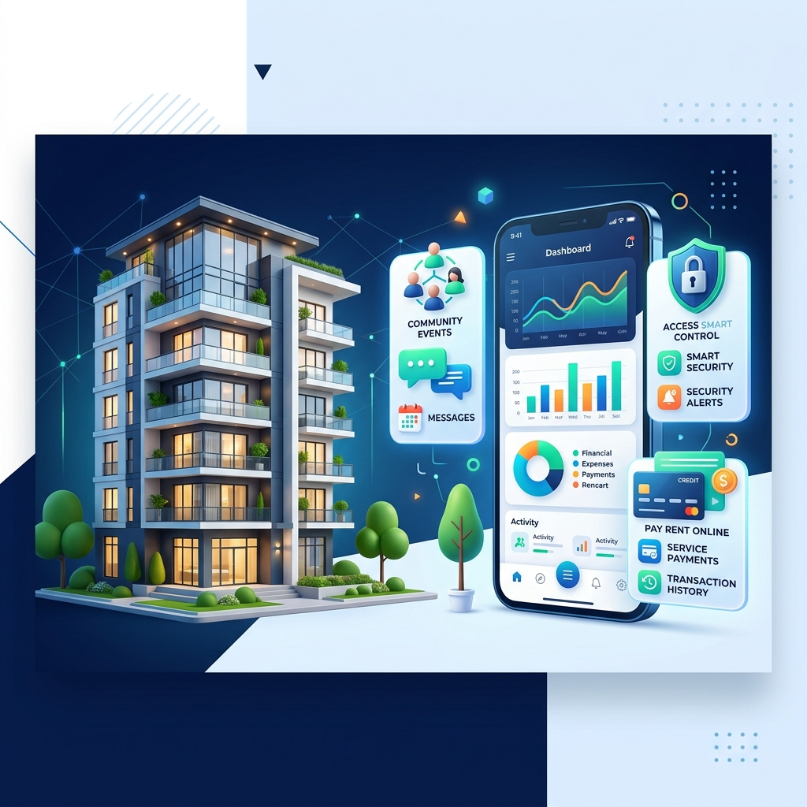

<div align="center">
  
</div>

# AidatPanel 🏢

[](mobile/)
[](backend/)
[](backend/)
[](backend/)

Türk apartman ve site yönetimi için geliştirilmiş modern, hızlı ve tam yığın (full-stack) monorepo çözümüdür. Yönetici ve sakinler için pratik kullanım sunan **mobil (Flutter)**, güçlü **backend (Node.js)** ve **web** bileşenlerinden oluşur.

---

## 📂 Proje Yapısı

| Klasör | Açıklama |
|--------|----------|
| [`mobile/`](mobile/) | **📱 Flutter Uygulaması:** Yönetici ve sakinler için iOS & Android arayüzü |
| [`backend/`](backend/) | **⚙️ Node.js API:** Express 5 + Prisma + PostgreSQL altyapısı |
| [`resources/`](resources/) | **📚 Kaynaklar:** Yol haritası, API notları, tasarımlar ve rehberler |
| [`web/`](web/) | **🌐 Web Sitesi:** Tanıtım ve landing sayfası (varsa) |

---

## 🚀 Hızlı Başlangıç

### 1️⃣ Backend (Yerel Geliştirme)

Backend klasörüne geçip bağımlılıkları yükleyin ve veritabanı ayarlarını yapılandırın:

```bash
cd backend
npm install
cp .env.example .env
# .env içindeki DATABASE_URL, JWT_* gibi değişkenleri düzenleyin
npx prisma migrate deploy
npm run dev
```

> **API Endpoint:** `http://127.0.0.1:4200/api/v1` 
> *Daha fazla detay için:* [`backend/README.md`](backend/README.md)

### 2️⃣ Mobil (Flutter)

Mobil uygulamayı derleyip çalıştırmak için:

```bash
cd mobile
flutter pub get
flutter run
```

> **Not:** Canlı API ve push bildirimleri test etmek için `main.dart` kullanılır. Mock verilerle geliştirmek için `flutter run -t lib/main_dev.dart` çalıştırabilirsiniz.

---

## 🔔 Bildirim Mimarisi (FCM & Realtime)

Uygulama içinde anlık bildirim (push) ve gerçek zamanlı rozet güncellemeleri kullanılmaktadır:

- **Push Bildirimleri:** Backend (`pushService.js`) üzerinden Firebase FCM'e iletilir. Mobil cihaz token'ı `PUT /me/fcm-token` ile kaydedilir.
- **Canlı güncelleme:** WebSocket (`/api/v1/realtime`) + FCM yedek — ayrıntı: [`resources/AIDATPANEL.md`](resources/AIDATPANEL.md) (Bildirim Sistemi)

---

## 📖 Ek Belgeler

- **Faz ve Görevler:** [`resources/yol-haritası/FAZ_DURUMU.md`](resources/yol-haritası/FAZ_DURUMU.md)
- **AI Asistan Kuralları:** [`CLAUDE.md`](CLAUDE.md)
- **Mimari + API + Bildirim:** [`resources/AIDATPANEL.md`](resources/AIDATPANEL.md)
- **Backend API:** [`backend/README.md`](backend/README.md)
- **Değişiklik geçmişi:** [`CHANGELOG.md`](CHANGELOG.md)
